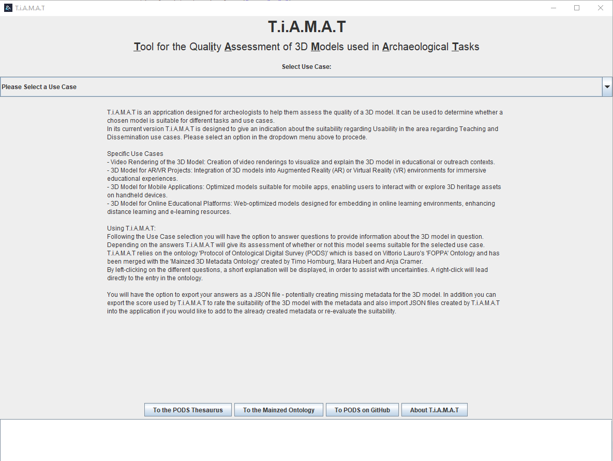
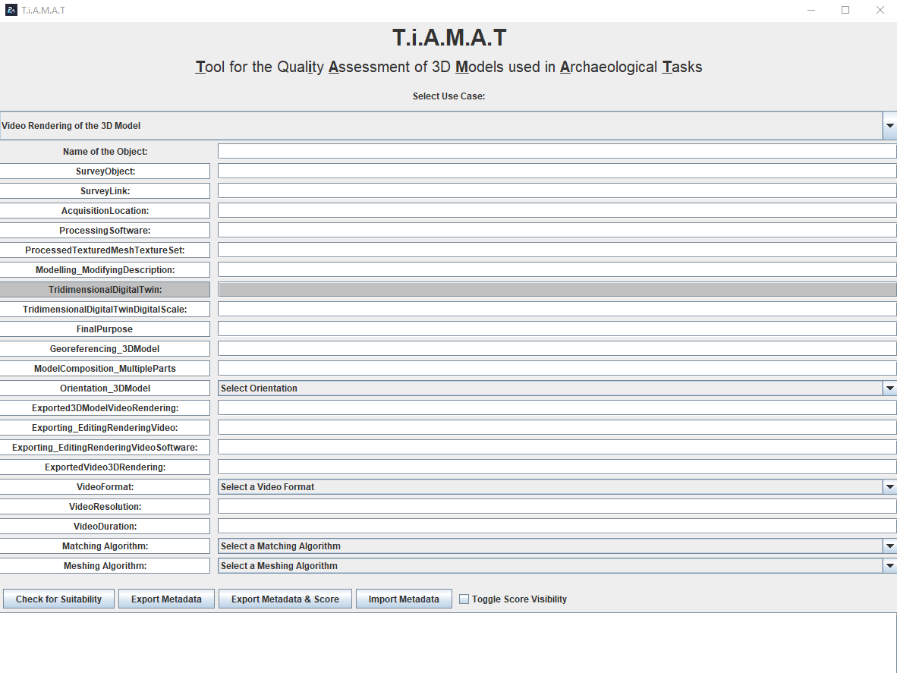
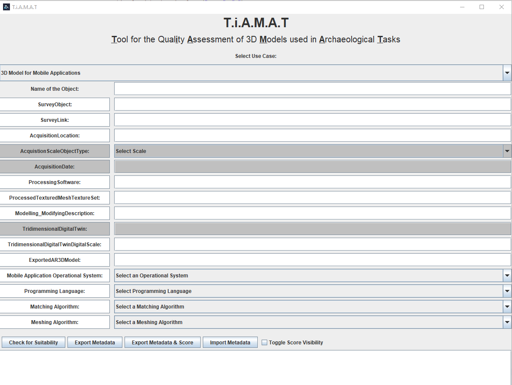

# T.i.A.M.A.T
Github Repository for the metadata tool for improved interoperability T.i.A.M.A.T.

Acronym for "**T**ool for the Qual**i**ty **A**ssessment of 3D **M**odels used in **A**rchaeological **T**asks". 

## Description
T.i.A.M.A.T is a tool accompanying the ontology project ["PODS"](https://github.com/Vlauro/PODS) by Vittorio Lauro and Timo Homburg. It can be used to determine the quality of a scanned 3D Model by taking the available metadata into consideration. It allows the user to not only export the input metadata as a JSON file but also ascertain whether a model could be used in certain use-cases. Currently T.i.A.M.A.T targets archaeologists and has use-cases for the area of "Teaching and Dissemination" implemented.

## Visuals
, 
, 

## Installation Note
T.i.A.M.A.T was created in the _Eclipse IDE_. In the Source Code folder I have uploaded the source code created for the application - along with the Logo and JSON Library.

## Usage
T.i.A.M.A.T has a dual usage for its users - firstly it acts as a way to create metadata of a 3D model by allowing the user to export the answers given regarding information about the model - such as the Processing Software used in its creation or the Digital Scale of the model. The user is required to relay the necessary information to T.i.A.M.A.T as seen in the Screenshots under 'Visuals'. By right-clicking on the questions/terms in the interface the user is automatically redirected to a full-length explanation of the term. Left-click displays a short explanation in the Log-Area of the application.
When all the available information is entered into the application the user can either directly export the metadata as a JSON file or use the primary funtion of T.i.A.M.A.T - the suitability check. Depending on the selected use-case a different set of questions is displayed and needs to be answered (not every field needs to be filled out but mandatory fields for the scoring are colored in dark grey). The Suitability Check gives the user an indication of whether or not the 3D model would be suitable for the selected use-case - based on the amount of known metadata. The 'Toggle Score Visibility' Check Box can be checked to show how the different questions are weighed. 
This scoring is based on the "European Union Indication 2022 for Survey of Cultural Heritage" and articles of M. Douglass et al., 2017; Pocobelli et al., 2018 and Lauro, 2024. 
Classes that are crucial to describe this basic level of the survey process were given a score of 3.
The items marked as "mandatory" are those considered essential to frame the model within a research context by answering the fundamental questions: "Where, When, What, How" (Official indications European Union 2022). As we move away from this core and into more specific subcategories, the score was kept at 1, reflecting their subsidiary role. For example, class F154, which describes the georeferenced positioning of a model, is a subcategory of the Processing and Modelling phases, and therefore derives from them.

If the user wants to test the suitability for a model where the metadata has already been exported by T.i.A.M.A.T, it can be imported again to rework the answers or test the suitability for different use-cases.

## Authors and acknowledgment
Project was created as an internship project with the Hochschule Mainz by Ann-Kathrin Weber.
Timo Homburg and Vittorio Lauro were key members in the creation process of the application.

## License
GNU GPLv3

## Sources

Sources used for the Scoring System of T.i.A.M.A.T:

- A.A.V.V. Final Study Report, Study on quality in 3D digitisation of tangible cultural heritage: mapping parameters, formats, standards, benchmarks, methodologies, and guidelines, Luxembourg: Publications Office of the European Union, 2022
- M. Douglass et alii, The Application of 3D Photogrammetry for In-Field Documentation of Archaeological Features, Cambridge University Press, 2017
- D. P. Pocobelli et alii, BIM for heritage science: a review, in Heritage Science volume 6, Article number: 30 (2018), https://doi.org/10.1186/s40494-018-0191-4 2018
- Lauro, Vittorio. "Harmonizing Photogrammetric Approaches for Cultural Heritage Preservation: A Methodological Framework and Comparative Analysis." Archeologia e Calcolatori 35, no. 2 (2024): 85–96. https://doi.org/10.19282/ac.35.2.2024.10.

## Project status
The project was an internship project as part of my Master's Degree in "Digitale Methodik in den Geistes- und Kulturwissenschaften" in Mainz. It was meant as a first exploration of the ascertation of the quality of 3D models.
